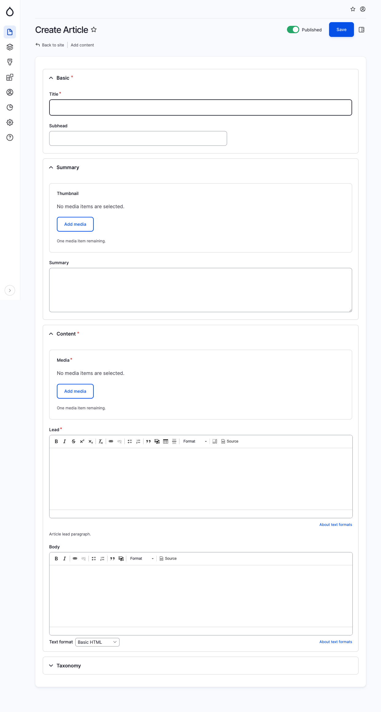

# Article

An article is commonly understood as a written composition that appears alongside other pieces in newspapers, magazines, or similar publications. In our default configuration, we incorporate a "Subhead" field within the "Basic" fields section, along with a teaser containing a summary. The content area encompasses the body of the article, media elements, a lead paragraph, and a set of Taxonomy fields.

By default, the media field serves as the hero image, while the lead field is utilized to emphasize an introductory paragraph above the main body of the article.

<figure><figcaption>
Create article page
</figcaption></figure>
