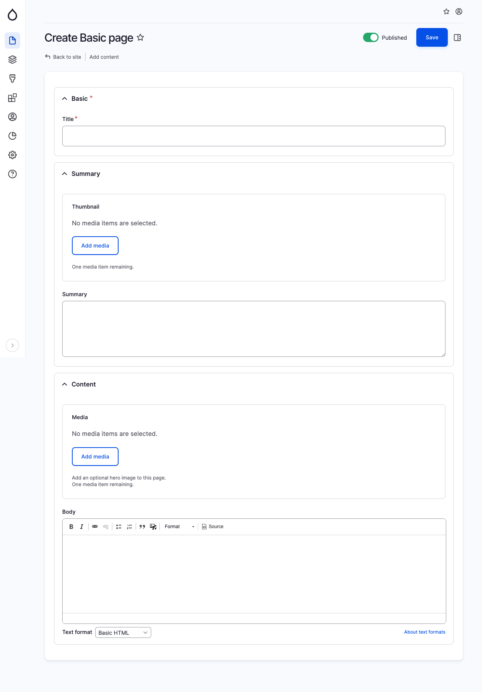

# Basic Page

The fundamental and widely used content type in a CMS is the "page" content type. This type of content is typically employed for more "static" information that doesn't require frequent updates. It comprises a basic section encompassing a title, a summary area featuring a thumbnail and summary text, and a content area consisting of media elements and body text. By default, the media field can be utilized as an optional hero image.

<figure><figcaption>
Create basic page
</figcaption></figure>
