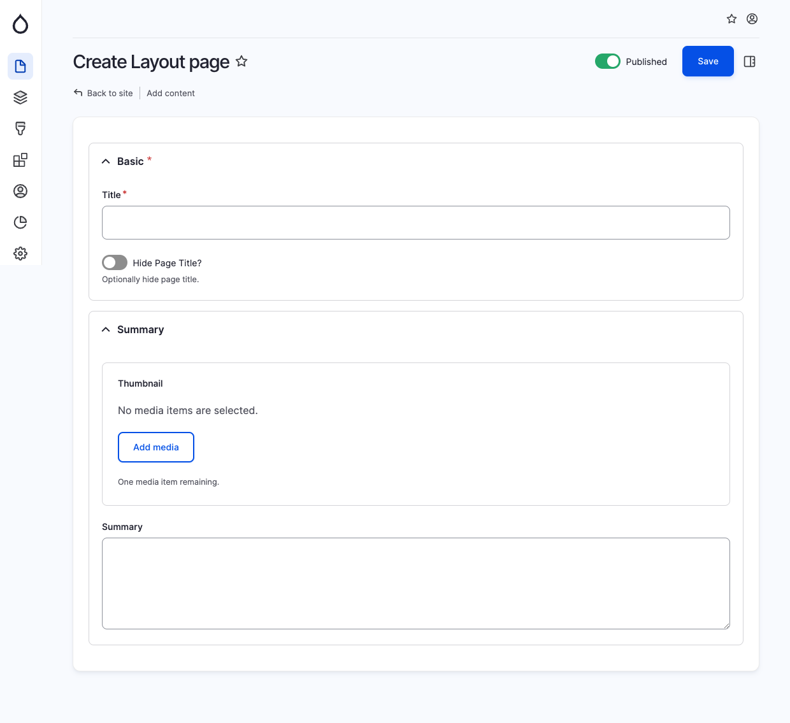

# Layout Page

The Layout Page comprises two groupings: Basic and Summary fields. Additionally, it offers the flexibility to hide the main h1 page title if desired. The remaining elements of the Layout Page can be easily constructed using the powerful Layout Builder tool.

<figure><figcaption>
Create layout page
</figcaption></figure>
