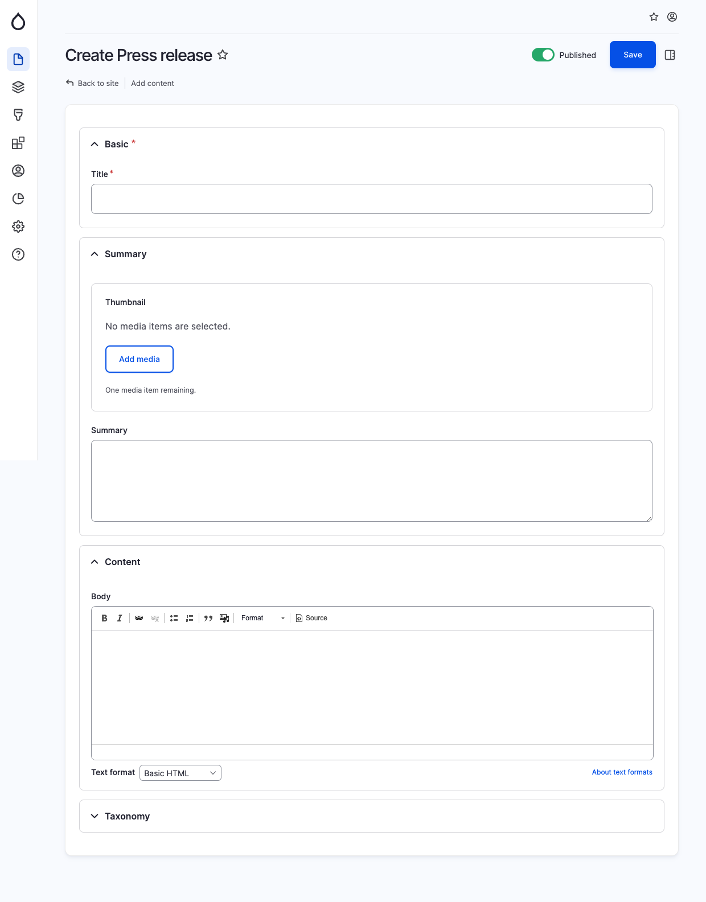

# Press Release

A press release is an official statement intended for newspapers, providing information on a specific matter. The press release content type shares similarities with articles, as it incorporates "Tags" and "Authors" within the Taxonomy group.

<figure><figcaption>
Create press release page
</figcaption></figure>
