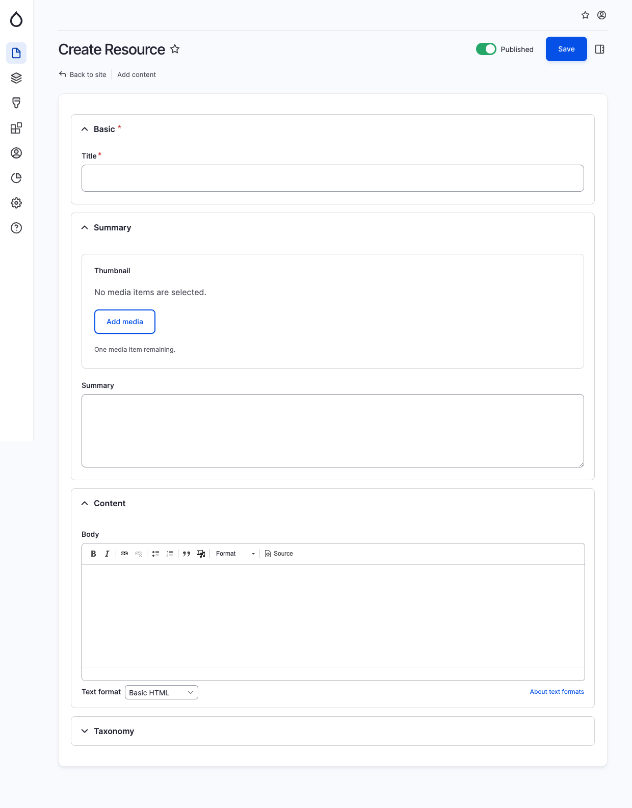

# Resource

Within Ignite, the "Resource" content type serves as a versatile option for library materials, including videos, white papers, documents, and various media formats. This may also encompass gated content on certain occasions. In the past, many builds have separated resource content into distinct types, offering certain advantages. However, more often than not, the content exhibits sufficient similarities to consolidate under a single umbrella content type.

To facilitate this, we incorporate the "Resource type" taxonomy, allowing editors to define multiple resource types without requiring additional content types.&#x20;

<figure><figcaption>
Create resource page
</figcaption></figure>
