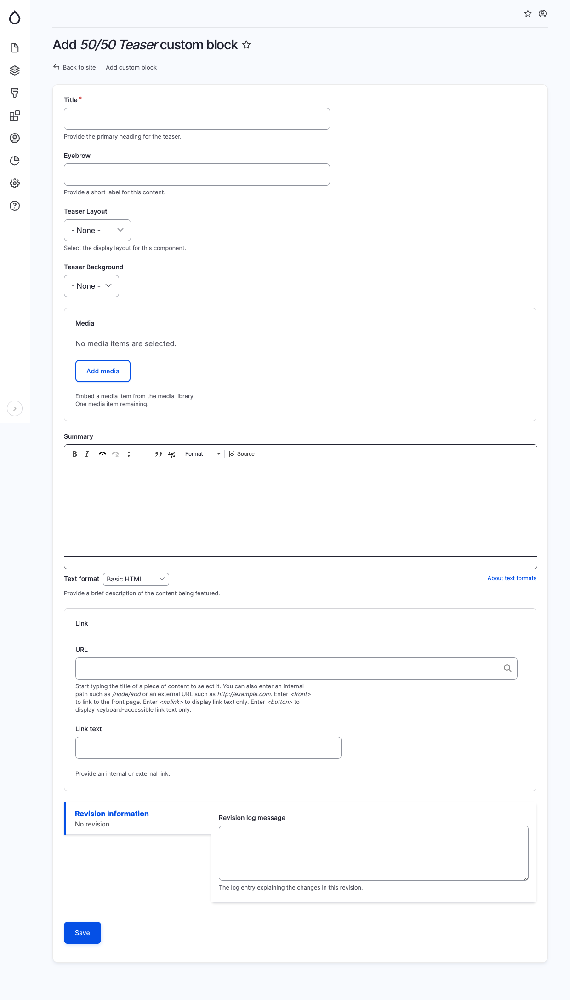

# 50/50 Teaser

To display an enticing preview featuring a stylized image and accompanying text, employ this component. When incorporating a Teaser block, provide the following details:

* Title: The main heading of the teaser.&#x20;
* Eyebrow: A concise label positioned above the title.&#x20;
* Teaser Layout: The visual arrangement of the teaser.&#x20;
* Teaser Background: The background color chosen for the teaser.&#x20;
* Media: (Optional) A media item selected from the media library.&#x20;
* Summary: (Optional) A brief description outlining the featured content.&#x20;
* Link URL: (Optional) Specify the URL of a website if a link or button is to be included.&#x20;
* Link Text: (Optional) If a Link URL is selected, designate the text to be displayed for the link.

<figure><figcaption>
Add teaser block
</figcaption></figure>
