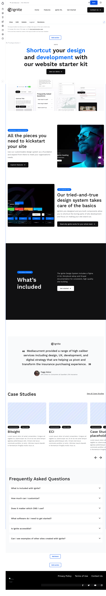

# Layout Components

\
Ignite CMS incorporates a powerful tool called Layout Builder, which adopts a component-based approach to construct content. With Layout Builder, the content of a page is divided into multiple "Content Blocks" or "Components" of various types. As the editor, you have the freedom to position these blocks onto the page layout in a top-down manner, indicating the desired blocks for building the page.

Please note that when creating a new page, it is necessary to provide a title, meta description, and slider (Hero image), and save the page before accessing the Layout. Once saved, when editing the page again, you will gain access to the "Layout" tab, allowing you to construct the page using components.

For existing pages, simply edit the page, and you will find the Layout tab available, as demonstrated in the example below.\

<figure><figcaption>
Layout builder tab screenshot
</figcaption></figure>

The layout view lets you place and arrange blocks to build your page**.**

<figure><figcaption>
Layout builder screenshot of the default demo homepage
</figcaption></figure>
