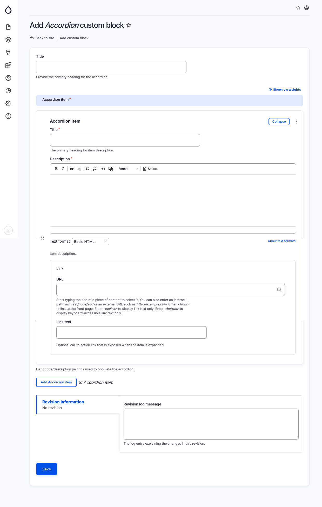

# Accordion

The Accordion component empowers the editor to create multiple sections of WYSIWYG text that can expand or collapse when clicked.&#x20;

Here are the fields that need to be filled out:

* Title: This serves as the main heading for the accordion.
* Each accordion item comprises the following fields:
  * Title: This represents the name of the accordion item, displayed in red, which is visible when the item expands or collapses.
  * Description: This field contains the body content for the accordion item.
  * Link URL: This field is optional. If you wish to include a stylized red call-to-action (CTA) button within the accordion, you can specify the website URL here.
  * Link Text: This field is optional. If you have chosen a Link URL, you can select the desired text to be displayed for the link.

<figure><figcaption>
Add accordion block
</figcaption></figure>
