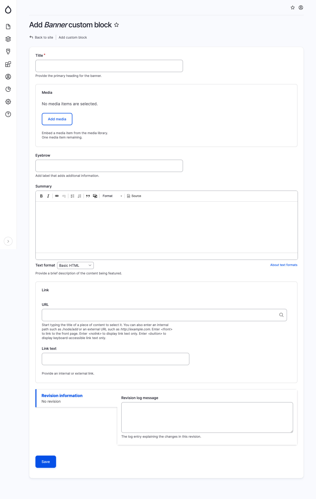

# Banner

The Banner component allows you to add a visually appealing block with an image and associated text. When adding a Banner block, provide the following details in the specified fields:

* Title: This serves as the main heading for the banner.
* Media: This field is optional. You can choose a media item from the media library to include an image in the banner.
* Eyebrow: This field is optional. It allows you to add an additional subheading or short phrase for emphasis.
* Summary: This field is optional. You can provide a brief description or summary of the content being featured in the banner.
* Link URL: This field is optional. If you want to include a link or button within the banner, specify the website URL here.
* Link Text: This field is optional. If you have chosen a Link URL, you can select the text to be displayed for the link or button.

<figure><figcaption>
Add banner block
</figcaption></figure>
