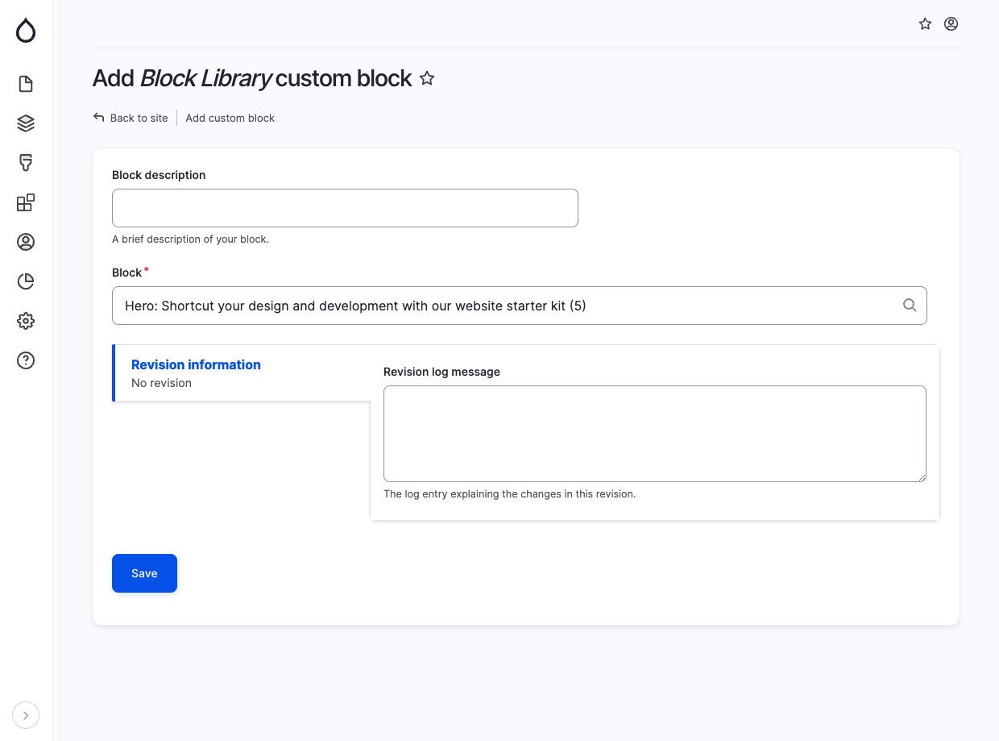

# Block Library

The Block Library component enables you to add an existing block from the Custom Block Library. To utilize this feature, follow these steps:

1. Go to Admin / Structure / Block Layout / Custom block library. Here, you can add reusable block entities that can be used later.
2. When placing a Block Library block, provide the following details in the specified fields:
   * Block: Use the autocomplete feature to search for the desired block by its title.

<figure><figcaption>
Add block library
</figcaption></figure>
