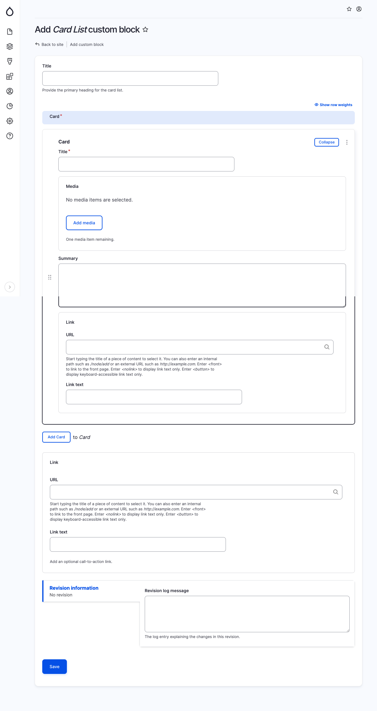

# Card List

To display a list of cards, utilize this component. When incorporating a Card List block, provide the following details:

* Title: (Optional) The main heading for the card list.&#x20;
* For each card, specify the following fields:&#x20;
  * Title: The main heading for the card.&#x20;
  * Media: (Optional) A media item selected from the media library.&#x20;
  * Summary: (Optional) A brief description outlining the featured content.&#x20;
  * Link URL: (Optional) Specify the URL of a website if a link or button is to be included.&#x20;
  * Link Text: (Optional) If a Link URL is selected, designate the text to be displayed for the link.

<figure><figcaption>
Add Card List block
</figcaption></figure>
