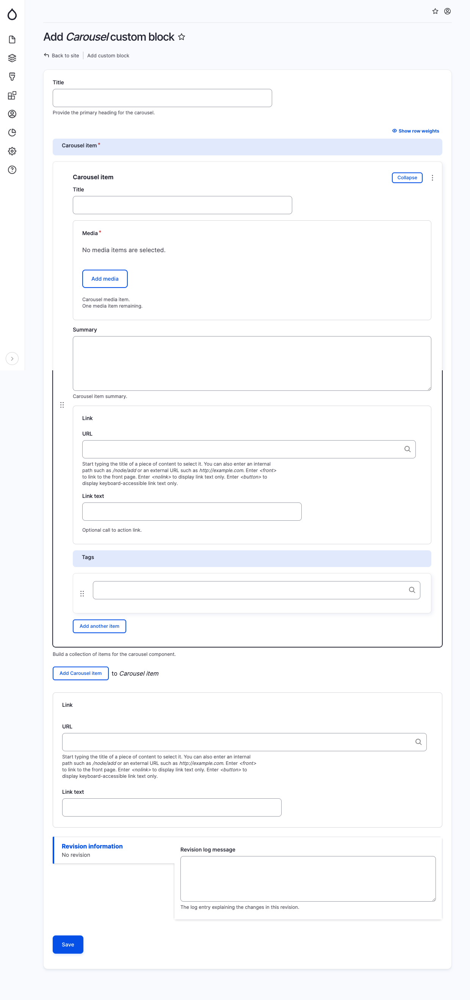

# Carousel

The Carousel block is a versatile tool that can be used to display a series of images or videos in a slideshow format. The block is easy to configure and can be used to promote content, showcase products, or simply add visual interest to a page.

To add a Carousel block, specify the following fields:

* Title: The title of the block.
* Carousel items: A list of carousel items. Each carousel item can have the following fields:
  * Title: The title of the carousel item.
  * Media: An image or video for the carousel item.
  * Summary: A brief summary of the carousel item.
  * Link URL: (Optional) Specify the URL of a website if a link or button is to be included.&#x20;
  * Link Text: (Optional) If a Link URL is selected, designate the text to be displayed for the link.
  * Tags: Tags for the carousel item.

<figure><figcaption>
Add carousel block
</figcaption></figure>
