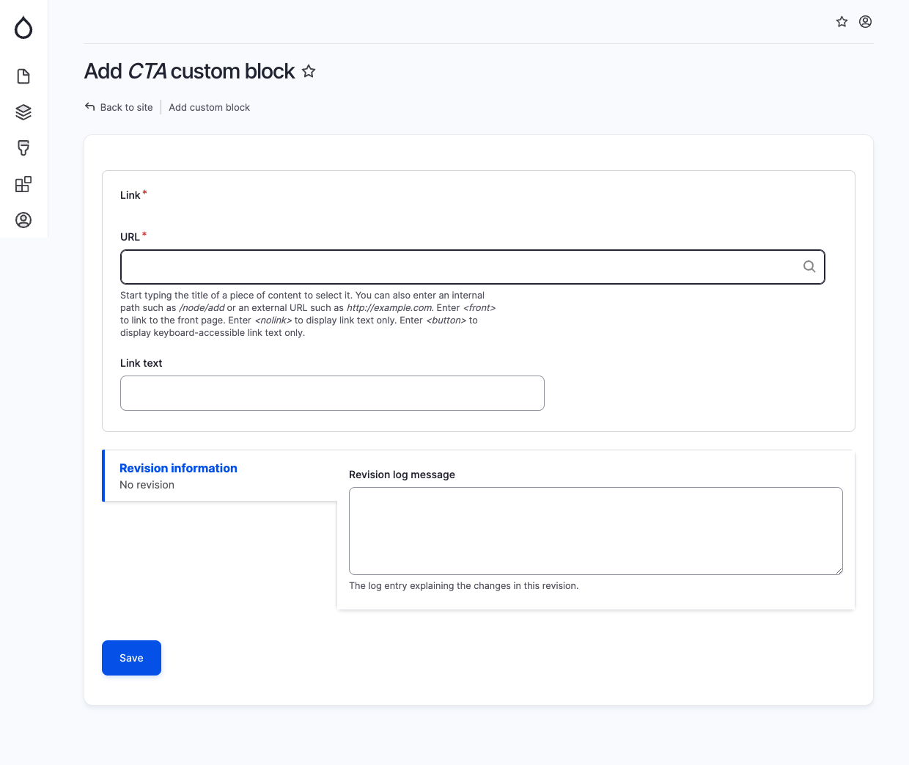

# CTA

The "CTA" (Call to Action) block is designed to create a visually appealing and attention-grabbing call to action on a webpage. This block provides an effective way to prompt users to take specific actions by including a link field with both the URL and text.

By utilizing the "CTA" block, you can easily customize and configure the following elements:

* Link URL: Specify the URL that the button should link to, directing users to the desired destination.
* Link Text: Choose the text that will appear on the button, clearly indicating the action users are encouraged to take.

With this flexible and user-friendly "CTA" block, you can effectively drive user engagement and guide visitors towards specific goals on your website.

<figure><figcaption>
Add CTA block
</figcaption></figure>
