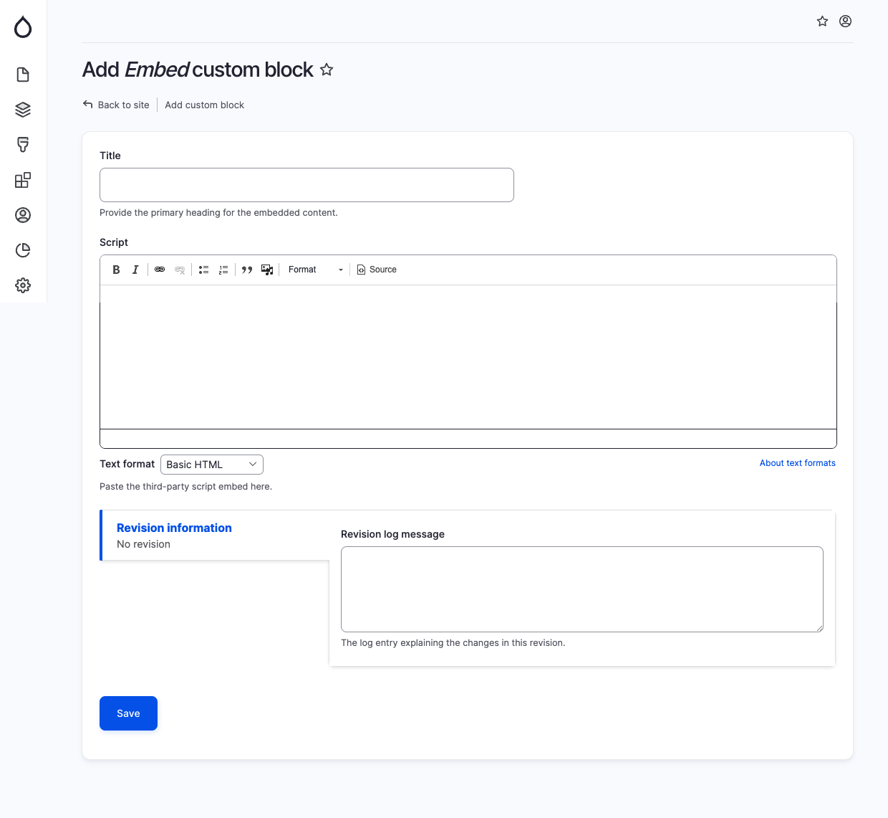

# Embed

The Embed component is utilized to insert embedded content, typically in the form of a third-party script. When adding an Embed block, provide the following details in the specified fields:

* Title: This field represents the main heading for the embedded content.
* Script: In this field, you can insert the third-party script that you want to embed.

<figure><figcaption>
Add embed block
</figcaption></figure>
