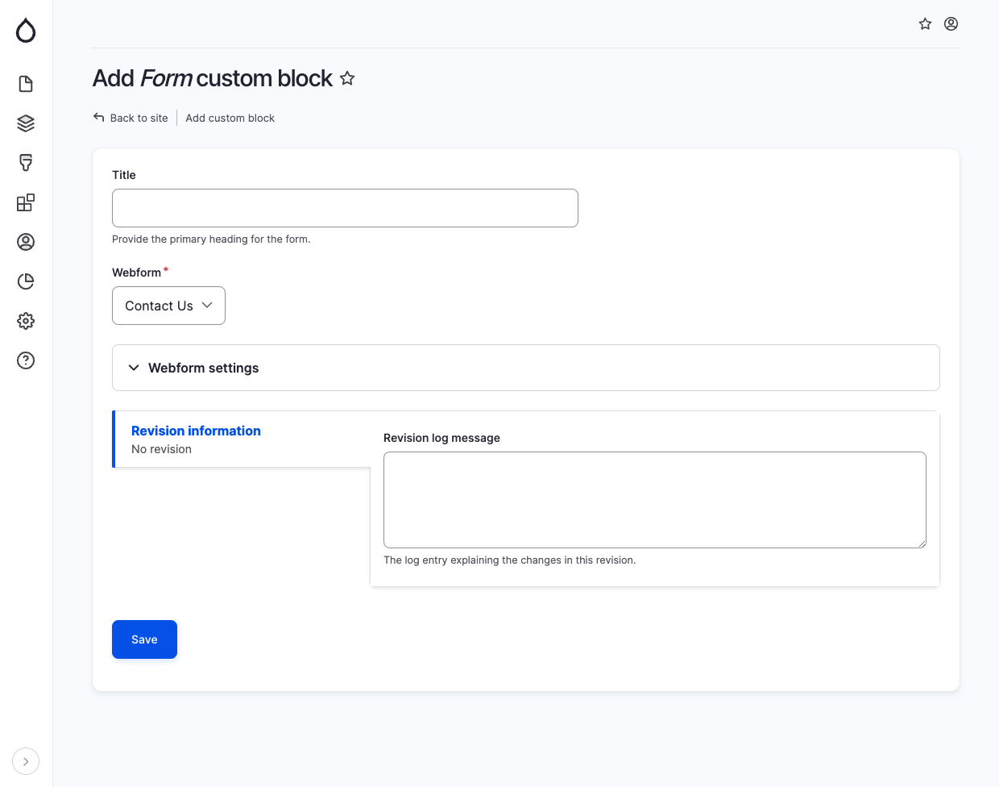

# Form

The Form component is employed to include a form within a page or section. When adding a Form block, provide the following details in the specified fields:

* Title: This field is optional and serves as the primary heading for the form.
* Webform: Select the desired form from the available options in the dropdown menu. Currently, the dropdown may contain a single choice, such as a contact form.

<figure><figcaption>
Add form block
</figcaption></figure>
