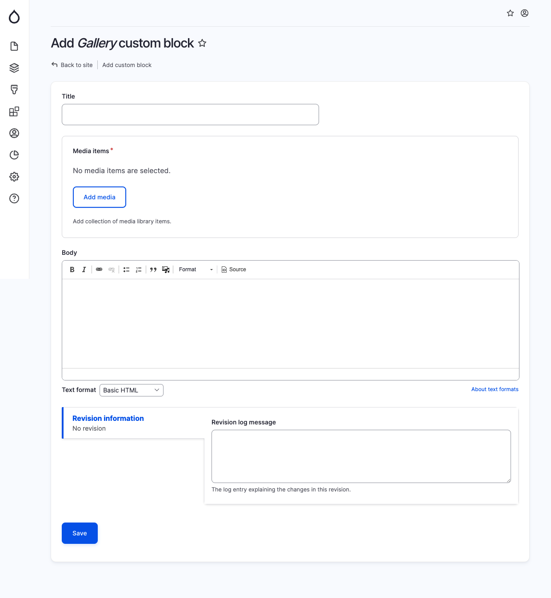

# Gallery

The Gallery component is utilized to display a collection of media items in a visually appealing manner. When adding a Gallery block, provide the following details in the specified fields:

* Title: This field is optional and serves as the primary heading for the gallery.
* Media Items: Add the desired media library items to the gallery. These can include images, videos, or other media files.
* Body: This field is optional. You can enter accompanying text or descriptions to provide context or additional information for the media items in the gallery.

<figure><figcaption>
Add gallery block
</figcaption></figure>
