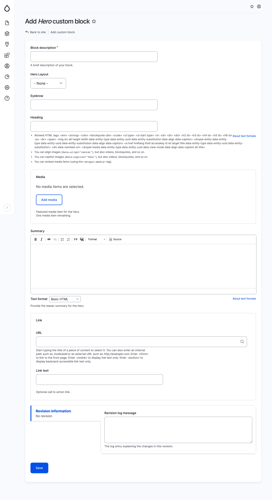

# Hero

The Hero component is employed to create a prominent and visually captivating section, often placed at the top of a page. When adding a Hero block, provide the following details in the specified fields:

* Title: This field is optional and serves as the primary heading for the hero section.
* Hero layout: Choose the desired design treatment for the rendered hero block, selecting from various predefined layouts.
* Eyebrow: This field is optional. It allows you to add a subheading or additional title for the hero.
* Media: This field is optional. You can include a featured media item, such as an image or video, to enhance the visual impact of the hero section.
* Summary: This field is optional. You can provide a brief teaser summary or description for the hero.
* Link URL: This field is optional. If you want to include a link or button within the hero, specify the website URL here.
* Link Text: This field is optional. If you have chosen a Link URL, you can select the text to be displayed for the link or button.

<figure><figcaption>
Add hero block
</figcaption></figure>
