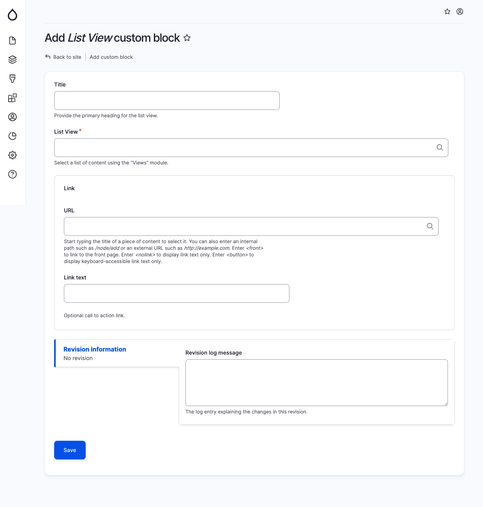

# List View

The List View component is utilized to display a list of content generated by the Views module. When adding a List View block, provide the following details in the specified fields:

* Title: This field is optional and serves as the primary heading for the list view.
* List View: Select the desired list of content using the Views module. This allows you to define the specific criteria and filters for the content to be displayed in the list.
* Link URL: This field is optional. If you want to include a link or button within the list view, specify the website URL here.
* Link Text: This field is optional. If you have chosen a Link URL, you can select the text to be displayed for the link or button.

<figure><figcaption>
Add list view block
</figcaption></figure>
