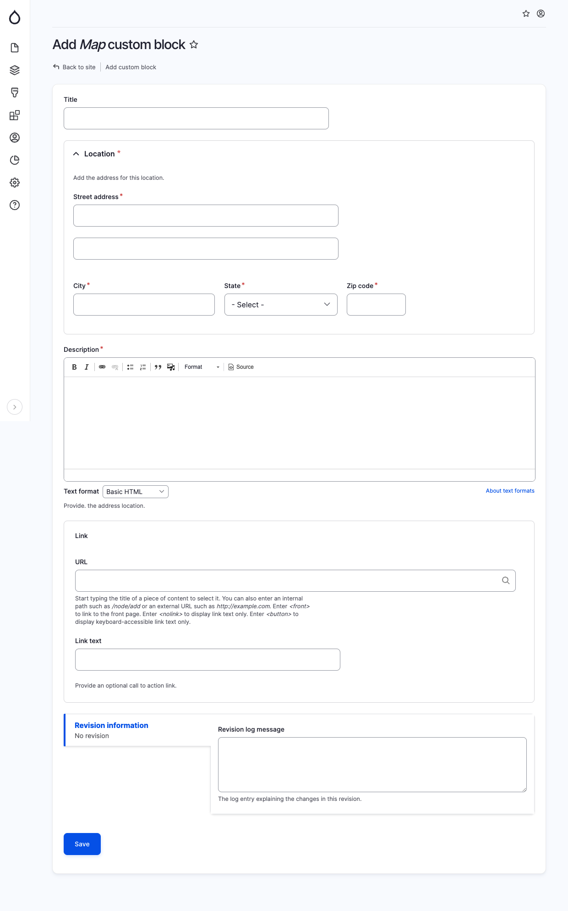

# Map

The Map component is utilized to display a location on a map. When adding a Map block, provide the following details in the specified fields:

* Title: This field is optional and serves as the primary heading for the map.
* Street Address: Enter the street address of the location.
* City: Enter the city where the location is situated.
* State: Enter the state or province of the location.
* Zip: Enter the ZIP code or postal code associated with the location.
* Description: Add any additional description or information about the location.
* Link URL: This field is optional. If you want to include a link or button within the map block, specify the website URL here.
* Link Text: This field is optional. If you have chosen a Link URL, you can select the text to be displayed for the link or button.

<figure><figcaption>
Add map block
</figcaption></figure>
