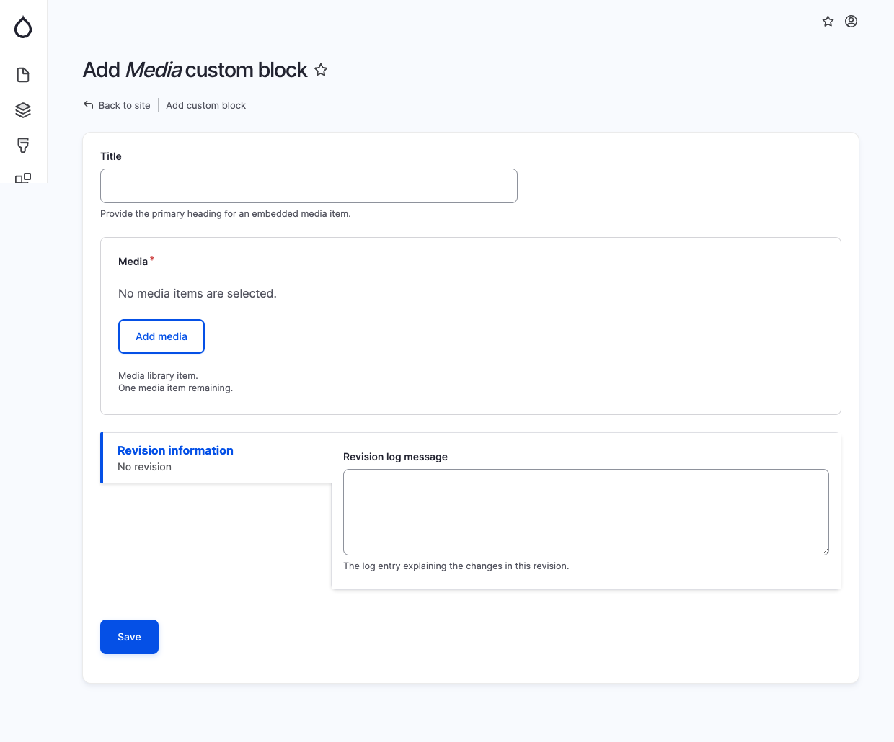

# Media

The Media block is used to add a media item (image or video) to a page. This block can be used to highlight a video or an image that you want to stand out on its own in a section.

To add a Media block, specify the following fields:

* Title: Optional - The primary heading for the media item.
* Media: A media item from the media library. Select one and only one.

Here are some additional tips for using the Media block:

* Use high-quality images or videos that are relevant to the content you are trying to convey.
* Keep the text brief and to the point.
* Use a clear and concise call to action, such as "Learn More" or "Watch Video."

The Media block is a versatile tool that can be used to add visual interest and promote your content.

<figure><figcaption>
Add media block
</figcaption></figure>

<figure><figcaption>
Add media library pop-up
</figcaption></figure>
