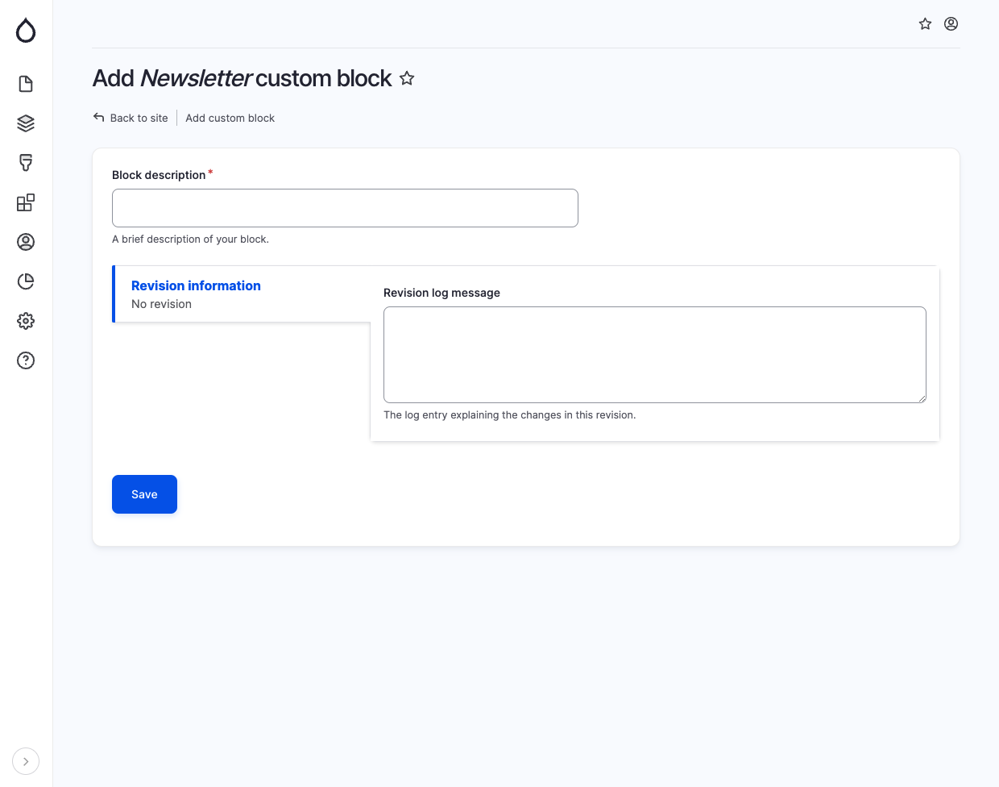

# Newsletter

The Newsletter block is a versatile tool that can be used to display a newsletter on a page.

Most organizations will use a third-party service for newsletter subscriptions so this block by default renders and example newsletter form which can be replaced by an iframe or integrationed with another service.

<figure><figcaption>
Add newsletter block
</figcaption></figure>
