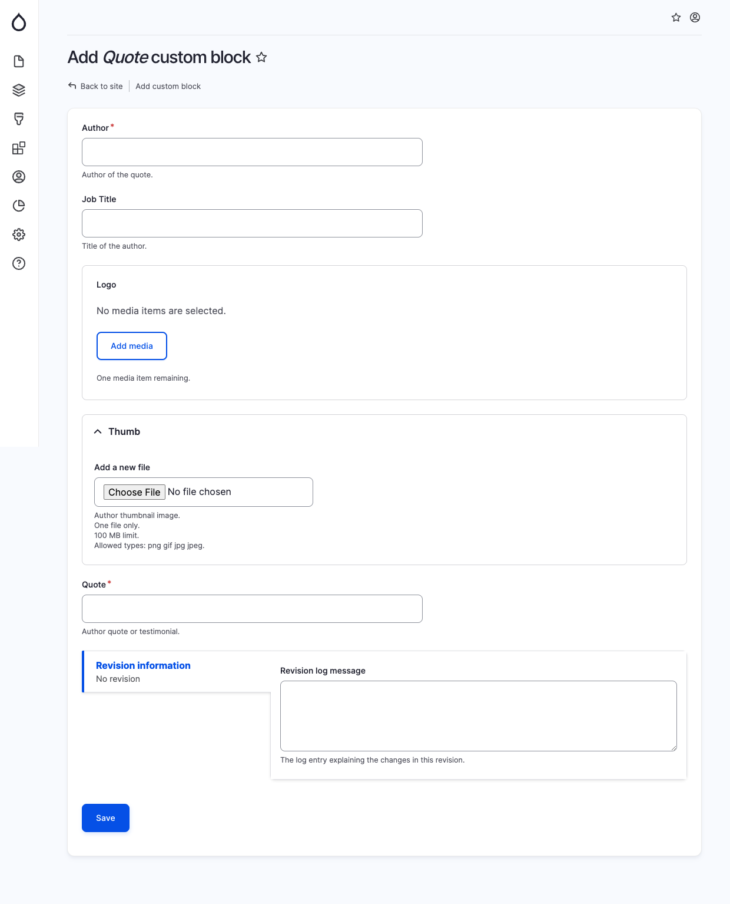

# Quote

To insert a quote, utilize this element.&#x20;

When incorporating a Quote block, provide the subsequent details:&#x20;

* Author: The individual responsible for the quote.
* Job Title: (Optional) The author's professional designation.
* Thumb: (Optional) An image representing the author.
* Quote: The precise quote or testimonial from the author.

<figure><figcaption>
Add quote block
</figcaption></figure>
