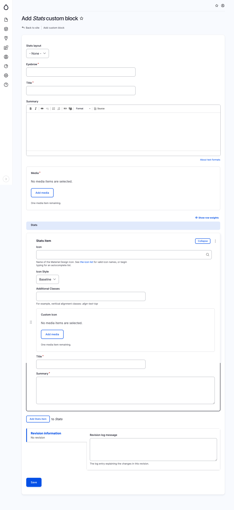

# Stats

The Stats block is a versatile tool that can be used to display a variety of statistics on a Drupal site. The block is easy to configure and can be used to promote content, showcase products, or simply add visual interest to a page.

To add a Stats block, specify the following fields:

* Stats layout: The layout of the stats block.
* Eyebrow: An optional additional subheading.&#x20;
* Title: The title of the block.&#x20;
* Summary: A brief summary of the stats block.&#x20;
* Media: An image or video for the block.&#x20;
* Stats items: A list of stats items. Each stat item can have the following fields:
  * Icon: The name of the Material Design icon for the stat item.&#x20;
  * Custom icon: An optional custom icon for the stat item.&#x20;
  * Title: The title of the stat item.&#x20;
  * Summary: A brief summary of the stat item. The Stats block is a great way to add visual interest and promote your content. With a little creativity, you can use it to create eye-catching blocks that will capture your audience's attention.

<figure><figcaption>
Add stats block
</figcaption></figure>
