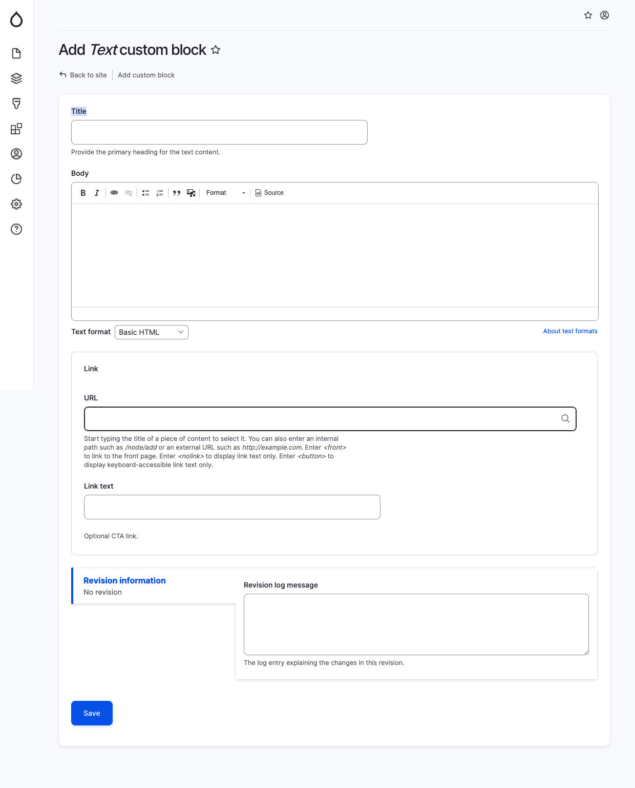

# Text

To insert a simple text block, use this component. It serves as a replacement for the conventional "Body" field. Similar to the "body" field, the "Text" block has Wysiwyg (What You See Is What You Get) functionality enabled by default. The advantage of our approach is that it provides multiple flexible ways to organize content on a page.

When adding a Text block, provide the following details:

* Title: (Optional) The main heading for the text content.&#x20;
* Body: (Optional) The main body of the text.&#x20;
* Link: (Optional) A call-to-action link associated with the text.

<figure><figcaption>
Add text block
</figcaption></figure>
