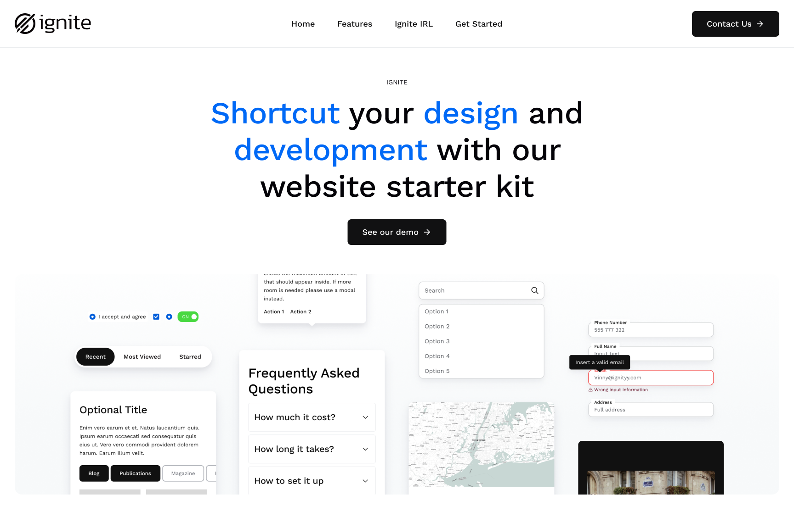

# Getting Started

The Ignite distribution ships with a [Bootstrap 5](https://getbootstrap.com/) powered "Ignite theme" that is paired with a demo install profile.

<figure><figcaption><p>Ignite Demo homepage</p></figcaption></figure>

The recommended approach to theming with Ignite is to create a custom Drupal theme using the theme generator tool. The generator tool is available on GitHub, and it includes detailed instructions on how to use it.


Theme generator 10


The generator tool allows you to pick and choose which components will be created in your custom theme. This gives you a great deal of flexibility in terms of the look and feel of your theme.

To use the generator tool, you will need to:

* Clone the Ignite GitHub repository.&#x20;
* Install the dependencies.&#x20;
* Run the generator command.&#x20;
  * Once you have run the generator command, you will be prompted to select the components that you want to include in your custom theme. Once you have made your selections, the generator will create a new directory containing your custom theme.
  * You can then customize your custom theme to match your needs. You can change the colors, fonts, and other aspects of the theme to create a unique look and feel.
  * The generator tool is a great way to create a custom Drupal theme quickly and easily. With a little effort, you can create a theme that is both visually appealing and functional.

Here are some additional tips for using the theme generator tool:

* Use the theme's documentation to learn more about how to use the components.&#x20;
* Use the theme's demo site to get inspiration for how to customize the components.&#x20;

The generator tool allows you to pick and choose which components will be created. Afterwards you can run the Storybook command to see all of the built-in components that ship with Ignite's design system.

<figure><figcaption><p>Storybook design system</p></figcaption></figure>

You can also generate a test page by enabling the **ignite\_features** module and running the following drush command:

```
drush kitchen-sink
```

This drush command will create a test page with every Ignite block type that you have enabled and can help you with testing.
